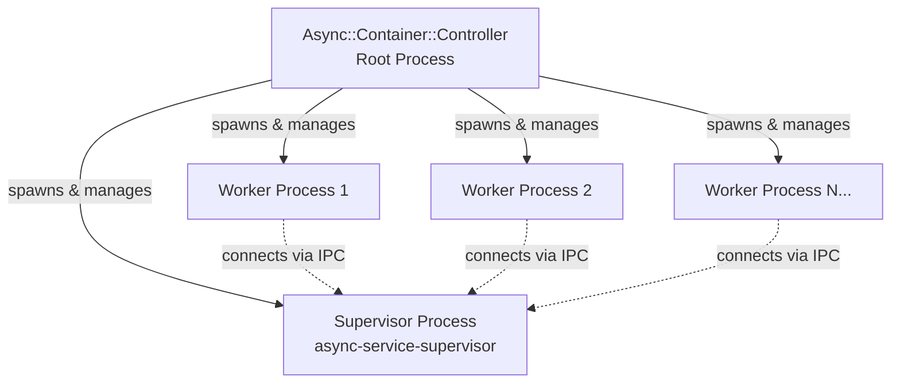

# Getting Started

This guide explains how to get started with `async-service-supervisor` to supervise and monitor worker processes in your Ruby applications.

## Installation

Add the gem to your project:

```bash
$ bundle add async-service-supervisor
```

## Core Concepts

`async-service-supervisor` provides a robust process supervision system built on top of {ruby Async::Service::Generic}. The key components are:

- {ruby Async::Service::Supervisor::Environment}: An environment mixin that sets up a supervisor service in your application.
- {ruby Async::Service::Supervisor::Supervised}: An environment mixin that enables workers to connect to and be supervised by the supervisor.
- {ruby Async::Service::Supervisor::Server}: The server that handles communication with workers and performs monitoring.
- {ruby Async::Service::Supervisor::Worker}: A client that connects workers to the supervisor for health monitoring and diagnostics.

### Process Architecture

The supervisor operates as a multi-process architecture with three layers:



**Important:** The supervisor process is itself just another process managed by the root controller. If the supervisor crashes, the controller will restart it, and all worker processes will automatically reconnect to the new supervisor. This design ensures high availability and fault tolerance.

## Usage

To use the supervisor, you need to define two services: one for the supervisor itself and one for your workers that will be supervised.

### Basic Example

Create a service configuration file (e.g., `service.rb`):

```ruby
#!/usr/bin/env async-service
# frozen_string_literal: true

require "async/service/supervisor"

class MyWorkerService < Async::Service::Generic
	def setup(container)
		super
		
		container.run(name: self.class.name, count: 4, restart: true) do |instance|
			Async do
				# Get the environment evaluator:
				evaluator = self.environment.evaluator
				
				# Prepare the instance (connects to supervisor if available):
				evaluator.prepare!(instance)
				
				# Mark the worker as ready:
				instance.ready!
				
				# Your worker logic here:
				loop do
					# Do work...
					sleep 1
					
					# Periodically update readiness:
					instance.ready!
				end
			end
		end
	end
end

# Define the worker service:
service "worker" do
	service_class MyWorkerService
	
	# Enable supervision for this service:
	include Async::Service::Supervisor::Supervised
end

# Define the supervisor service:
service "supervisor" do
	include Async::Service::Supervisor::Environment
end
```

### Running the Service

Make the service executable and run it:

```bash
$ chmod +x service.rb
$ ./service.rb
```

This will start:
- A supervisor process listening on a Unix socket
- Four worker processes that connect to the supervisor

### Adding Health Monitors

You can add monitors to observe worker health and automatically respond to issues. Monitors are useful for:

- **Memory leak detection**: Automatically restart workers consuming excessive memory.
- **Performance monitoring**: Track CPU and memory usage trends.
- **Capacity planning**: Understand resource requirements.

For example, to add monitoring:

```ruby
service "supervisor" do
	include Async::Service::Supervisor::Environment
	
	monitors do
		[
			# Log process metrics for observability:
			Async::Service::Supervisor::ProcessMonitor.new(
				interval: 60
			),
			
			# Restart workers exceeding memory limits:
			Async::Service::Supervisor::MemoryMonitor.new(
				interval: 10,
				maximum_size_limit: 1024 * 1024 * 500  # 500MB limit per process
			)
		]
	end
end
```

See the {ruby Async::Service::Supervisor::MemoryMonitor Memory Monitor} and {ruby Async::Service::Supervisor::ProcessMonitor Process Monitor} guides for detailed configuration options and best practices.

### Collecting Diagnostics

The supervisor can collect various diagnostics from workers on demand:

- **Memory dumps**: Full heap dumps for memory analysis via `ObjectSpace.dump_all`.
- **Memory samples**: Lightweight sampling to identify memory leaks.
- **Thread dumps**: Stack traces of all threads.
- **Scheduler dumps**: Async fiber hierarchy
- **Garbage collection profiles**: GC performance data

These can be triggered programmatically or via command-line tools (when available).

#### Memory Leak Diagnosis

To identify memory leaks, you can use the memory sampling feature which is much lighter weight than a full memory dump. It tracks allocations over a time period and focuses on retained objects.

**Using the bake task:**

```bash
# Sample for 30 seconds and print report to console
$ bake async:container:supervisor:memory_sample duration=30
```

**Programmatically:**

```ruby
# Assuming you have a connection to a worker:
result = connection.call(do: :memory_sample, duration: 30)
puts result[:data]
```

This will sample memory allocations for the specified duration, then force a garbage collection and return a JSON report showing what objects were allocated during that period and retained after GC. Late-lifecycle allocations that are retained are likely memory leaks.

The JSON report includes:
- `total_allocated`: Total allocated memory and count
- `total_retained`: Total retained memory and count  
- `by_gem`: Breakdown by gem/library
- `by_file`: Breakdown by source file
- `by_location`: Breakdown by specific file:line locations
- `by_class`: Breakdown by object class
- `strings`: String allocation analysis

This is much more efficient than `do: :memory_dump` which uses `ObjectSpace.dump_all` and can be slow and blocking on large heaps. The JSON format also makes it easy to integrate with monitoring and analysis tools.

## Advanced Usage

### Custom Monitors

You can create custom monitors by implementing the monitor interface. A monitor should:

1. Accept connections and periodically check worker health
2. Take action (like restarting workers) when unhealthy conditions are detected

### Fault Tolerance

The supervisor architecture is designed for fault tolerance:

- **Supervisor crashes**: When the supervisor process crashes, the root controller automatically restarts it. Workers detect the disconnection and reconnect to the new supervisor.
- **Worker crashes**: The container automatically restarts crashed workers based on the `restart: true` configuration.
- **Communication failures**: Workers gracefully handle supervisor unavailability and will attempt to reconnect.

This design ensures your application remains operational even when individual processes fail.
